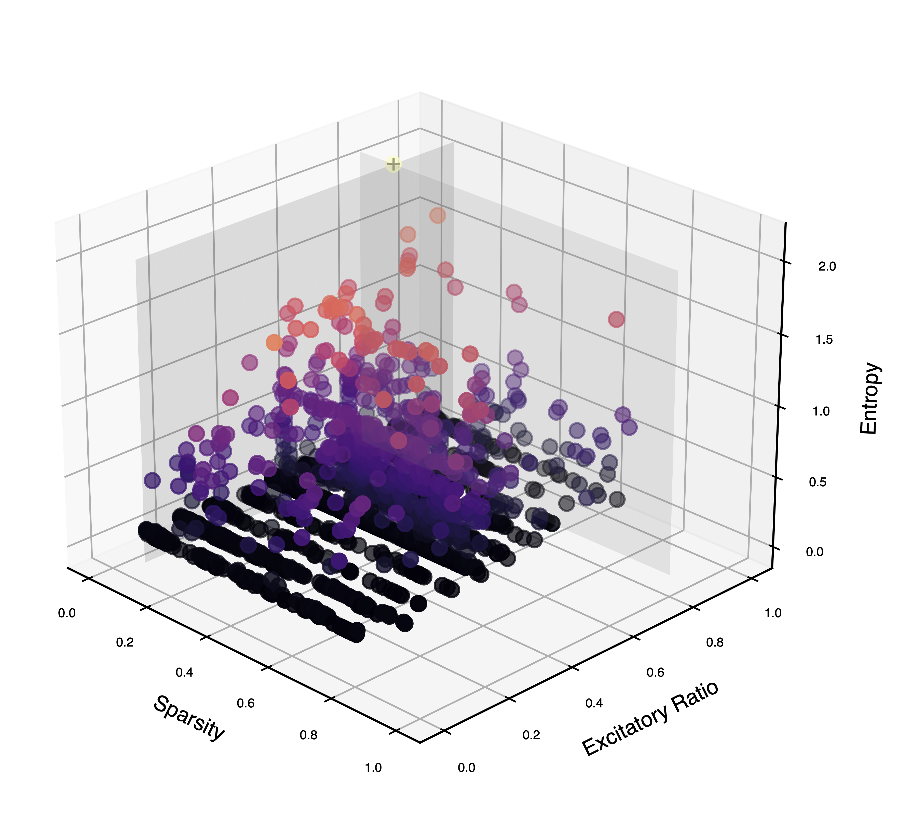
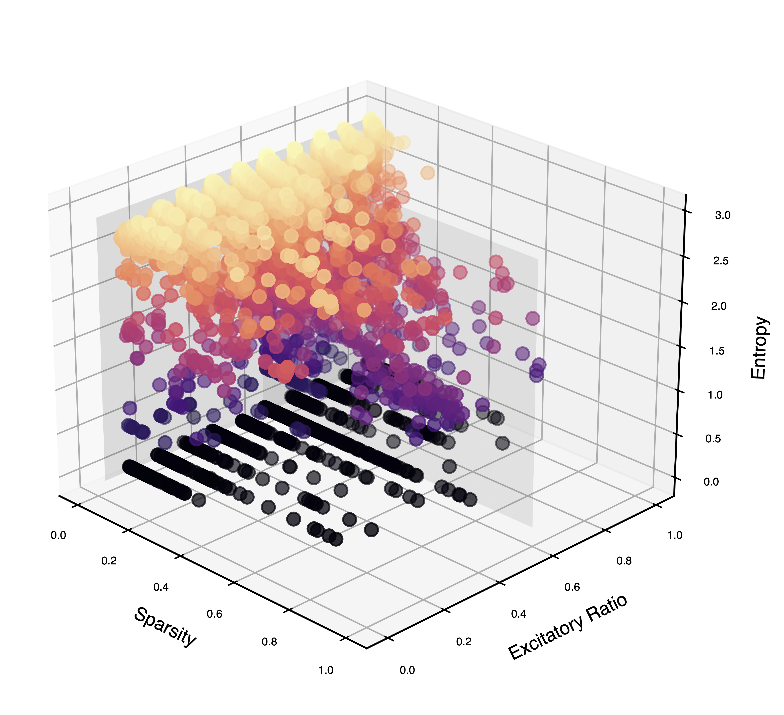

# neural-entropy

An experimental validation exploring the link between neural network entropy and real-world empirical biological observations.

## Overview

The primary purpose of this experiment was to expand upon the results of the paper [*Estimating neural network entropy from recorded spiking activity via Markov chains*](https://link.springer.com/article/10.1007/s11135-025-02520-0) [1]. Although the Markov chain entropy estimator presented therein faces several drawbacks from a statistical-theoretic sense (particularly severe undersampling bias for networks consisting of more than a few neurons), the alignment between high-entropy network dynamics and established neurophysiological parameters deserved further exploration nevertheless.

Specifically, the hypothesis is that nature has mediated part of the brain's construction with, at least, some intention of maximizing the entropy of spiking activity. Expectedly, then, biologically-inspired spiking neural network models should converge to similar empirical parameters if explicitly optimized for entropy. 

The prior work ran experiments on a small network of 10 conductance-based (COBA) leaky-integrate-and-fire (LIF) neurons. Here, a large-scale simulation of thousands of differently initialized Liquid State Machines (LSMs) [2] has been conducted.

## Results

The results of the performed optimization reveal that LSM networks with a connection sparsity of `20%` and an E/I ratio of `80%` present with the highest entropy; remarkably, these are precisely the canonical parameters of real cortical networks [4, 5].

|  |
| :-: |
| Figure 1. Optimizing the estimated Shannon entropy of the state-transition Markov chain's stationary distribution reproduces networks with physiological configurations. |

|  |
| :-: |
| Figure 2. Optimizing the estimated topological entropy of the state-transition Markov chain yields no discernible preference for parameters. |

In contrast, the topological entropy of the state-transition Markov chain yielded high values for many of the configurations, showing no convergence to any set of parameters in particular. However, given the nature of the estimator used, it is likely that the topological entropy estimates are overestimated.

> [!NOTE] The work and codebase herein actually predate the creation time of this repository by over a year. On account of this, nothing will be expressly maintained; the findings and implementations contained herein are intended to serve as reference and contribution to the general body of science. Consequently, if seeking to replicate the experiment, ensure that everything be brought up to date.

## Methodology

The methodology underlying the experiment is rather simple: a suite of Liquid State Machines (LSMs) was initialized from a space of possible parameters (see the `sweep.json` file) and promptly simulated; afterwards, a state-transition Markov chain was constructed from the network's spiking activity [1]; lastly, the Shannon entropy of the stationary distribution of this transition chain was computed. An optimization algorithm was run on the aforementioned entropy result with the objective of maximization. The optimization was done via the Optuna library [3].

## Repository Structure

The repository itself contains three branches:
- The `main` branch houses the completed experiment, which was run with two Tau T2D instances from Google Cloud.
- The `golem/task-api` is an experimental branch that attempted to use the [Golem Network](https://golem.network/) for decentralized computation of the parameter sweep; although tasks are provisioned and execute successfully, this approach was eventually abandoned due to difficulties with securing a sizable number of providers. The `ray-on-golem` project was also originally used, but equally abandoned for the same reasons.

> [!NOTE] If there is an error in the Golem code preventing proper large-scale usage, or the implementation is unoptimized, please [open an issue](https://github.com/Lleyton-Ariton/neural-entropy/issues) to flag the issue. Improvements, clarifications, and observations are highly encouraged. 

## Citation

If you would like to use the results obtained from this experiment within your own research, please cite the following:
```bibtex
@misc{ariton2026neuralentropy,
  author       = {Ariton, Lleyton},
  title        = {neural-entropy: An experimental validation exploring the link between neural network entropy and real-world empirical biological observations},
  year         = {2026},
  publisher    = {GitHub},
  howpublished = {\url{[https://github.com/Lleyton-Ariton/neural-entropy](https://github.com/Lleyton-Ariton/neural-entropy)}},
  note         = {GitHub repository}
}
```

## References

[1] Aghababaei Jazi, O. & Ariton, L. Estimating neural network entropy from recorded spiking activity via Markov chains. Qual. Quant. 60, 5933–5946 (2025).

[2] Maass, W., Natschläger, T. & Markram, H. Real-time computing without stable states: a new framework for neural computation based on perturbations. Neural Comput. 14, 2531–2560 (2002).

[3] Akiba, T., Sano, S., Yanase, T., Ohta, T. & Koyama, M. Optuna: A next-generation hyperparameter optimization framework. in Proceedings of the 25th ACM SIGKDD International Conference on Knowledge Discovery & Data Mining 2623–2631 (ACM, New York, NY, USA, 2019). doi:10.1145/3292500.3330701.

[4] Garey, L. Cortex: Statistics and Geometry of Neuronal Connectivity, 2nd edn. By V. BRAITENBERG and A. SCHÜZ. (Pp. xiii+249; 90 figures; ISBN 3 540 63816 4). Berlin: Springer. 1998. J. Anat. 194, 153–157 (1999).

[5] Song, S., Sjöström, P. J., Reigl, M., Nelson, S. & Chklovskii, D. B. Highly nonrandom features of synaptic connectivity in local cortical circuits. PLoS Biol. 3, e68 (2005).
